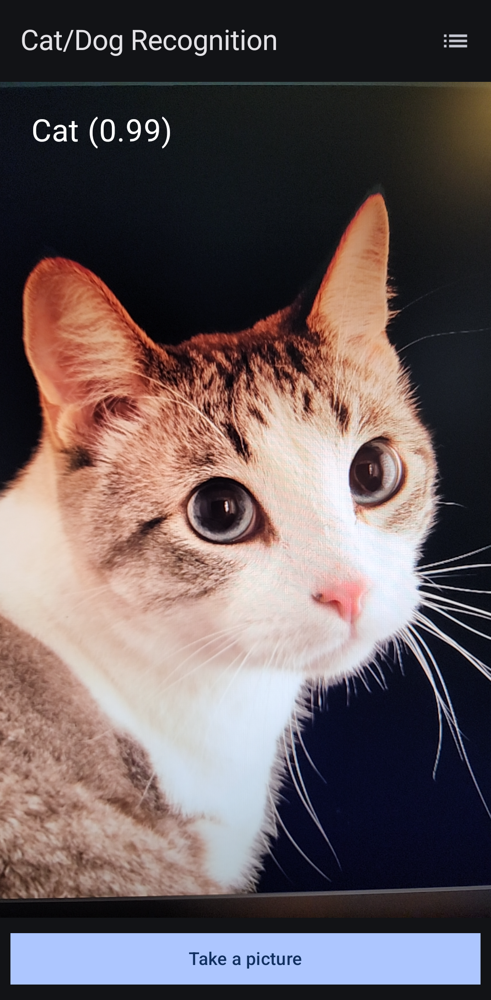
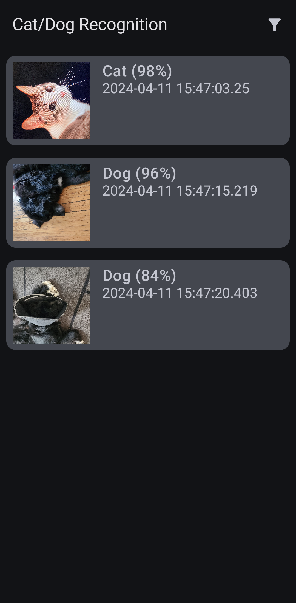

# DynetiProject

DynetiProject is an Android demo application that uses machine learning to classify images as either containing a cat or a dog. The application is built with Kotlin and uses Jetpack Compose for UI, TensorFlow Lite for image classification, and Firebase for data storage and retrieval.

## Features

- **Image Classification**: Classify images as either containing a cat or a dog with high accuracy.
- **Firebase Integration**: Store and retrieve image classification results from Firebase.
- **Jetpack Compose UI**: Modern, declarative UI built with Jetpack Compose while following Material Design guidelines.
- **Sorting and Filtering**: Sort and filter the list of image classification results by timestamp, classification, or confidence score.
- **Crashlytics Integration**: Monitor and track application crashes using Firebase Crashlytics.

## Design Decisions

There were a few interesting choices I made throughout the development of this product. I got a little carried away and started to integrate Firebase Realtime DB instead of using an internal DB like Room. This was partially due to curiosity and because I wanted to add Crashlytics bug tracking (a product that I love). As for the general demo app architecture, I chose to go with an MVC model as it is quite simple to prototype with. If I were trying to make an app with longevity, I would probably have chosen MVVM.

I have left the SDK as a module; it could be easily ported as a .aar and hosted for others to use. Within the DynetiSDK module, I have created a README that has documentation on how the SDK works. I did add support for bounding boxes, although this model only classifies images as cats or dogs. This feature could be added quite quickly with a correctly trained model.

I also found that the model given wasn't quite accurate; I've tested it quite a bit on my dogs and pictures of cats. This is out of my control, but I am sure that with a better model, the SDK could be quite useful.

## Screenshots

## Components

- **MainActivity**: The entry point of the application. It sets up the camera and image analysis use cases, handles the image capture process, and the classification of the captured image using the TensorFlow Lite model. The classification result is then saved to Firebase.
- **ListActivity**: Retrieves the image classification results from Firebase and displays them in a list. The list can be sorted by timestamp, classification, or confidence score.
- **ImageResult**: A data class that represents the result of an image classification. It includes the unique key for the result in Firebase, the filename of the image, the class name of the detected object, the confidence score of the classification, the bounding box of the detected object, and the timestamp when the image was captured and classified.
- **dbCalls**: Contains functions for creating an `ImageResult` object, saving an `ImageResult` object to Firebase, and gathering all the image classifications from Firebase.

## Usage

To use the application, grant the camera permission when prompted. Press the "Take Picture" button to capture an image. The application will classify the image and display the class name and confidence score on the screen. The classification result will also be saved to Firebase. Press the "List" button to view the list of image classification results.

## Installation

To install the application, clone the repository and open the project in Android Studio. Build the project and run it on an Android device or emulator.

I've also included the APK in the root of the project ('app-debug.apk'). As an alternative, you can download the APK and sideload it onto your device.

## License

This project is licensed under the terms of the MIT license.
